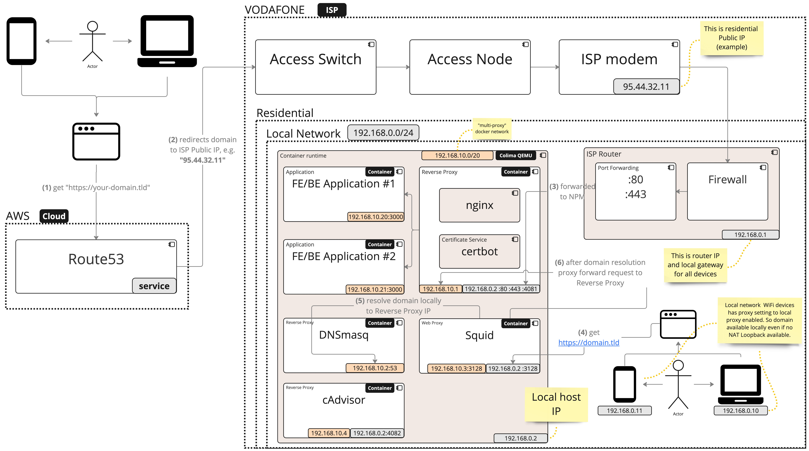
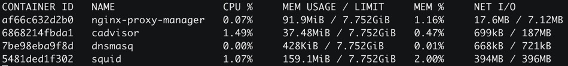

# rnd-nginx-proxy-manager

- [Motivation](#motivation)
- [How to start](#how-to-start)
- [How to add host](#how-to-add-host)
- [Troubleshooting](#troubleshooting)
    * [If you don't have NAT loopback configured by your ISP, i.e. you can't make request to domain pointing to your Public IP](#no-nat-loopback)
        + [Option #1 - when you don't need to access domain locally frequently - use Brave Tor](#option-1)
        + [Option #2 - when few hosts in local network need access - update /etc/hosts](#option-2)
        + [Option #3 - when Wi-Fi hosts or many hosts need acces via domain name - use dnsmasq + squid](#option-3)
            - [Setup `dnsmasq`](#setup-dnsmasq)
            - [Setup `squid`](#setup-squid)
        + [Option #4 - let's make everything in docker without sudo](#option-4)  

## Goal

- Launch Nginx-Proxy-Manager(NPM) locally as reverse-proxy for any domain referencing to the address ISP Public IP
- With minimal system footprint and manual effort

## Context

- Platform: `Mac M1`
- `NAT loopback` disabled by ISP, i.e local device can't access services using its public IP address from within the same network. It means that one can't access `your-domain.tld` proxied service from the same network. 

## How to start

0. Docker setup
   - Install `docker` (using `colima` or `docker desktop` wrappers)
   - Check if `docker` default context uses proper socket
     ```bash
     colima status # will output socket path
     docker context ls #check for default (*) context socket link
     # if it shows error or socket path is wrong, then update it via DOCKER_HOST vars, e.g. for zshrc
     echo "export DOCKER_HOST=unix:<path-to-socket>/docker.sock" >> ~/.zshrc
     # restart shell
     docker context ls # check socket path again
     ```
1. Nginx-Proxy-Manager(NPM) setup
   - Copy `project.env.dist` to `project.env` and set the values
   - Create if not exists folders: "nginx-proxy-manager/data", "nginx-proxy-manager/letsencrypt"
   - Execute `make up` or `make restart` - if you see permission errors, run 2 times more - it will create `./data` and `./letsencrypt` folders. Then it will launch successfully
2. Set desired subdomain(e.g. `your.domain.tld`) `A` record pointing to the ISP public IP ([portchecker](https://portchecker.co/) can help to check public IP and open ports)
3. Setup port forwarding for NginxProxyManager on your router:
   - Local server network IP, e.g. `192.168.0.111`
   - `TCP/UDP 192.168.0.111 :80 → :80`
   - `TCP/UDP 192.168.0.111 :443 → :443`
4. Open NPM admin panel, use default credentials to login to NPM
   - `localhost:4081`
   - `admin@example.com`
   - `changeme`
5. Click on "Add proxy host"
   - **Domain name** - `your.domain.tld`, without `http`, `https`, or `port`. Just plain domain name.
   - **Scheme** - `http` - it’s your local service access scheme
   - **Forward hostname** - if NPM not in the same `docker-compose`, put your local server LAN IP, e.g. `192.168.0.111`
   - **Forward port** - local service access port, e.g. `3000`
   - **Block common exploits** - `check`
   - **SSL**
       - **certificate** - generate for subdomain - `your-domain.tld`
       - You can generate it from the settings form or choose generated before from list
       - Check `Force SSL`, `HSTS`, `HTTP/2 support`, `HSTS subdomains`
6. Go to System Settings → Network → Wi-Fi (or your selected active connection) → Advanced → Proxies. 
   - Add `<local-host-ip>` with `port=<SQUID_PORT>` as proxy(e.g. `proxy=192.168.0.111, port=3128`).
   - Do the same for Wi-Fi clients, which need to access `your-domain.tld` from local network
   - Now all local and Wi-Fi DNS and HTTP/S requests will be proxied through the `squid`

## Solution description

With NAT loopback disabled by the ISP, local network devices cannot access the proxied service using the `your-domain.tld` name. There are various options available for solving this problem, which are described below for educational purposes. The current solution utilizes a non-root `docker-compose` approach with `squid` and `dnsmasq`. Custom `arm64` `squid` image used to disable file logs and pipe them to docker native logs to manage log rotation on docker-compose level. Also, custom image of `cadvisor` used since there is no official `arm64` version.

Configuration for `squid` and `dnsmasq` updated by `generate-config.bash` script on every docker  `make <command>`. You just need to have `project.env` properly filled.

Here is the deployment diagram for the solution:


**Description:**
1. External user flow
    - (1) - External internet user makes request to `your-domain.tld`
    - (2) - DNS (AWS in this case) resolve it to the ISP Public IP 
    - (3) - When request reaches local network ingress, router it redirects it to local NPMs `:80` or `:443` ports. Then it resolves to configures local network service according to NPM configuration
2. Local user flow
   - (4) - User from the same residential network make request to the `your-domain.tld` from his browser. And his network already configured to use proxy. Which in fact is `Squid` proxy server running in the docker-compose configuration with NPM 
   - (5) - `Squid` configured to resolve domains using `dnsmasq`. Which is aware of `your-domain.tld` to be forwarded to NPM `multi-proxy` network IP. 
   - (6) - When domain name IP resolved, `squid` proxied requests to NPM

**Notes**
- This is known tradeoff - with `squid` proxy enabled on your local devices, all their DNS and HTTP traffic will go through the `squid` on host machine. On "Macbook Pro M1" it utilizes ~0.02 cores



- There is [cAdvisor](https://github.com/google/cadvisor) on port `:4082` present in docker-compose in order to monitor resource utilization

- Locally `dig` and `nslookup` will resolve your domain to Public IP, but it's okay, because every HTTP/S request will be processed by `squid <-> dnsmasq -> nginx-proxy-manager`

### Other options
Described options leaves considerable system footprint or hardly scalable.

<details>

<summary>Option #1 - when you don't need to access domain locally frequently - use Brave Tor</summary>

To access your reverse-proxy resource by domain name you need to access it from different internet connection (if your ISP doesn’t support NAT loopback)
- Open “New Private Window with Tor” (Brave)
- Connect via mobile hotspot from other device
- Use Android “HTTP shortcuts” app with mobile connection (disabled WiFi)

</details>

<details>
<summary>Option #2 - when few hosts in local network need access - update /etc/hosts</summary>

Or you can you local domain forward by adding your domain and IP address to the `/etc/hosts` file. You may have to use sudo or editor.
```text
echo "127.0.0.1 sub.<your-domain>.com" >> /etc/hosts
dscacheutil -flushcache # Flush the DNS cache for the changes to take effect
```

</details>

<details>
<summary>Option #3 - when Wi-Fi hosts or many hosts need acces via domain name - use dnsmasq + squid</summary>

Setup `dnsmasq`
- `brew install dnsmasq`
- To start dnsmasq now and restart at startup
  ```bash
  sudo brew services start dnsmasq
  ``` 
- Copy the default configuration file. And set your domain resolution to IP
  ```bash
  edit /opt/homebrew/etc/dnsmasq.conf
  # add "address=/test.my-domain.com/127.0.0.1"
  # uncomment for logging "log-queries"
  # add "log-facility=/var/log/dnsmasq.log"
  # add server "server=8.8.8.8"
  # uncomment and add "listen-address=127.0.0.1"
  sudo brew services restart dnsmasq
  ```
- Go to System Settings → Network → Wi-Fi (or your selected active connection) → Advanced → DNS.
  Then, add `127.0.0.1` to your DNS Servers.
- Flush DNS cache: 
  ```bash
  sudo killall -HUP mDNSResponder
  ``` 
- ping your domain to check if it resolved locally:
  ```bash
  ping test.my-domain.com
  ``` 
  
**Notes:**
- test resolution 
  ```bash
  dig example.dev
  nslookup example.dev
  ping example.com
  ```

Setup `squid`

The thing is, that your local network wi-fi mobiles still not able to resolve your domain locally (because only rooted Android allowed to change `/etc/hosts`). So, let's try local web proxy then with `squid` & `dnsmasq`

- When dnsmasq installed
- Add to dnsmasq config 
  - `edit /opt/homebrew/etc/dnsmasq.conf`
  - dhcp-option=252,”http://127.0.0.1:3128/wpad.dat”
- Now let's setup `squid`
```bash
brew install squid
cp /opt/homebrew/etc/squid.conf /opt/homebrew/etc/squid.conf.back
edit /opt/homebrew/etc/squid.conf
```
- Replace config with the following allow-all simple config:
```bash
# Squid normally listens to port 3128
http_port 3128

# We setup an ACL that matches all IP addresses
acl all src all

# We allow all of our clients to browse the Internet
http_access allow all

# We strongly recommend the following be uncommented to protect innocent
# web applications running on the proxy server who think the only
# one who can access services on "localhost" is a local user
#http_access deny to_localhost
```
- `squid -z` to check conf
- `sudo brew services restart dnsmasq`
- `brew services restart squid` - non-root!
- check logs
  - log file `/opt/homebrew/var/logs/cache.log`
  - access log `/opt/homebrew/var/logs/access.log`
- Now go to your mobile, open "WiFi settings" -> Proxy -> manual -> 
  - set IP : `192.168.0.??` (set your squid server ip)
  - set port: `3128`
- Check your domain `test.my-domain.com` from mobile browser, now it should be resolved via squid -> dnsmasq -> npm -> your local server!!!
**Note:**
- By doing this all DNS & HTTP traffic from mobile clients browser (with configured proxy) and local DNS requests will go through `dnsmasq` and `squid`.

</details>

